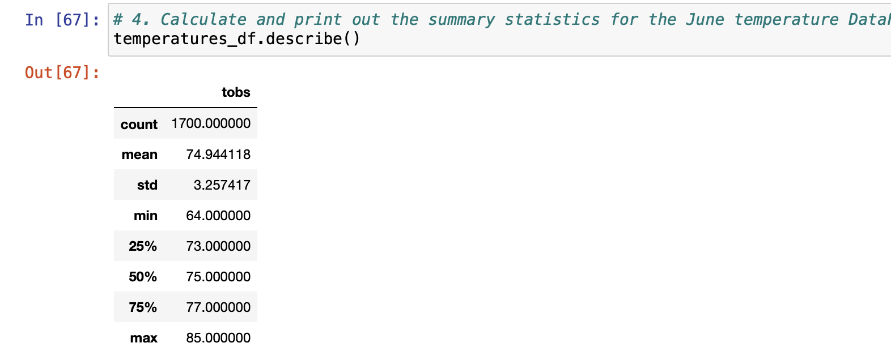
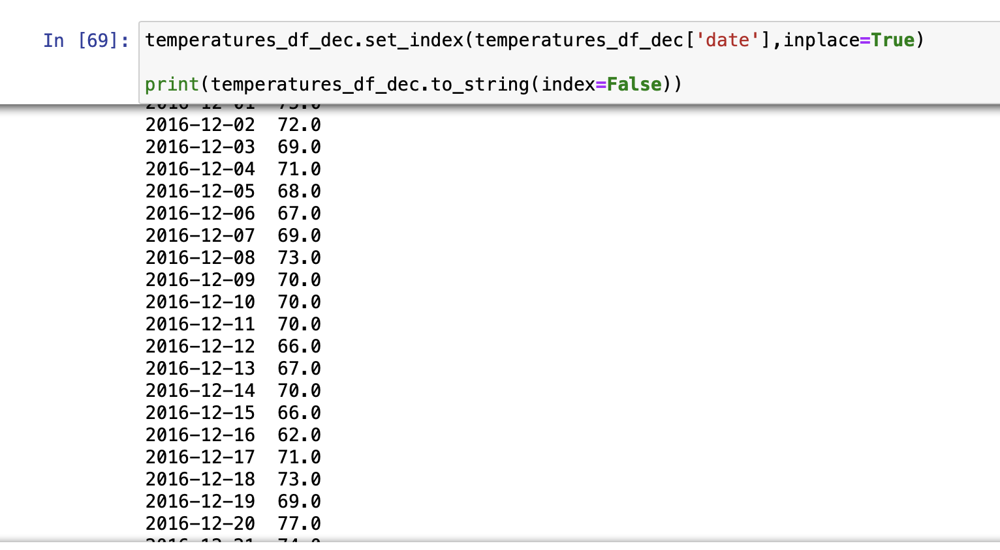
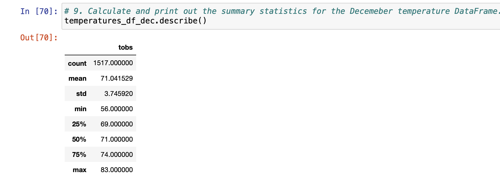
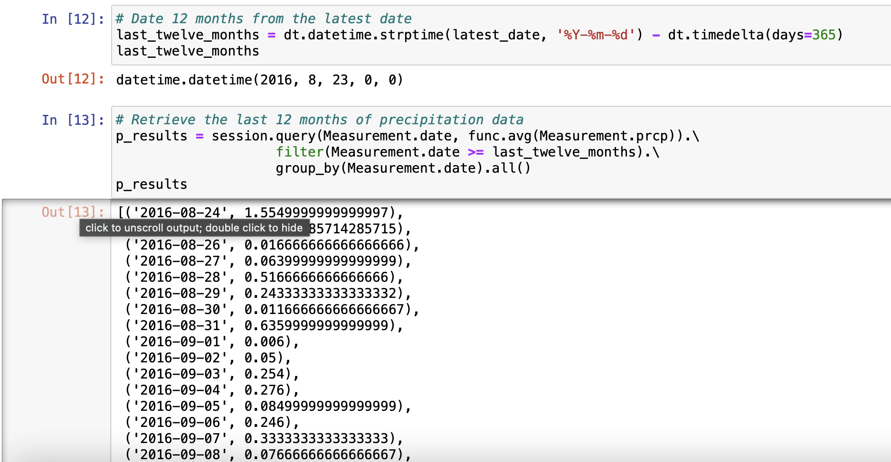
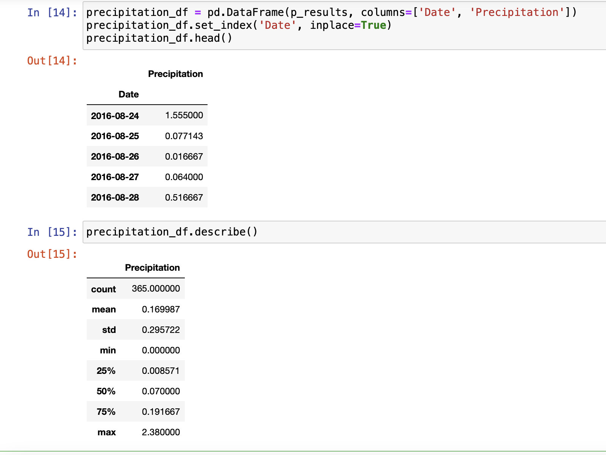
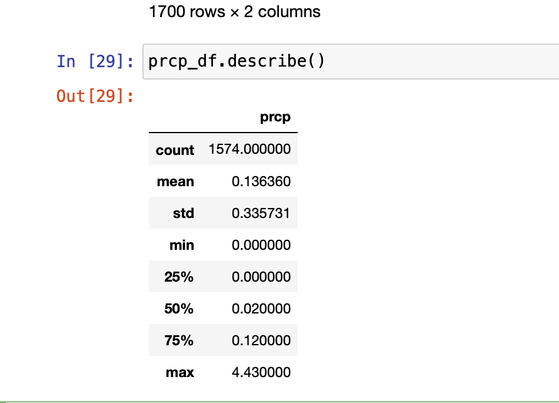
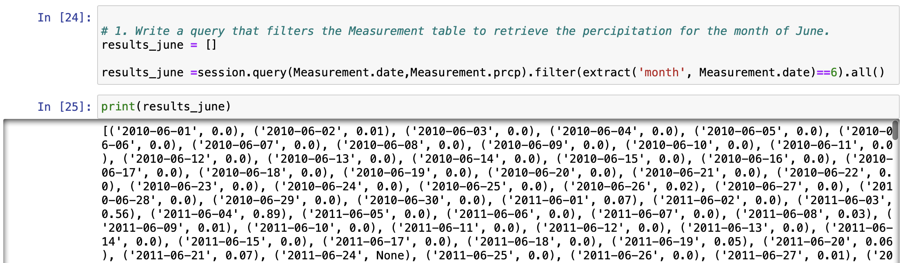
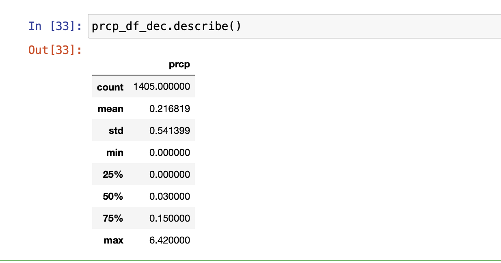
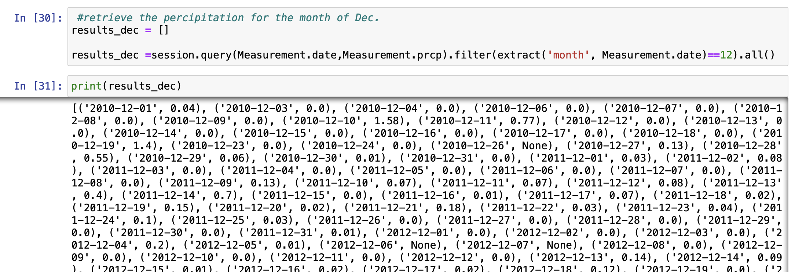

## Overview of the Analysis

Investing in the surf up business in hawai a Surf and Shake shop serving surfboards and ice cream to locals and tourists. We'll need some real investor backing to get this off the ground. So after putting together a strong business plan, we  reach out to an investor, W. Avy, who is famous for his love of surfing.
So we are doing weather analysis for last 5 -6 years and creating the descriptive analysis for the investor.

## Results

The key differences between the weather temperatures in month of June and December are 
 
 ####           June Temps

* Max temperature in June is 85 F while in the December month Max temperature is 83 F almost same. 

* Also we can infer that major difference is in the minimum temperatures of both the months 
we can see that min temp in June is 64 f while in December is much cooler with min temp of 56 f. It can be analysed that December is colder compared to June 

* Mean temperatures for both the months are also almost same with no major differences. So this location temperature is almost stable

### December Temps

## Summary 

Overall we summarize that Hawai is excellent location for openeing Surfing shop. 
we have done Temperature analysis in the same way we can do check the percipitation for last 12 months and do the analysis

We can infer that average rainfall in Hawai in last 12 months is about 0.16 inches with maximum of 2.38 inches. After retrieving for last 12 months we can also analysis for the month of June and December and compared it 
#### June rainfall

#### December rainfall

